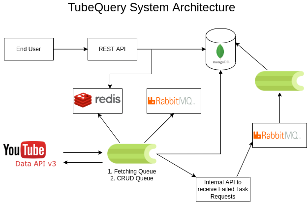

# TubeQuery

Microservices to pull the latest video information from YouTube and query them.

## System Architecture



## Features Included

- [x] Built Worker to fetch YouTube Video Information periodically (every 10 seconds).
- [x] API to query Video information stored in the database.
- [x] Pagination Incorporated.
- [x] Databases Indexed for faster querying.
- [x] Basic search query for Title and Description incorporated.
- [x] Dockerized for easy deployment.
- [x] Built keeping optimization and scalability in mind.
- [x] Added support for multiple API Keys.
- [x] Search query optimization to search videos by tags.
- [x] Code Standardization through linting.
- [x] Storing failed requests and tasks for further investigation and action.
- [x] Request Caching in API.
- [x] Failsafe pipeline to handle and retry failed requests.

## Documentation

Postman Documentation: [Click Here.](https://documenter.getpostman.com/view/6334156/UzBiNU3S)

## Installation & Setup

Please make sure you have docker installed in your system.  

Step 1: Create a ```.env``` file in the root directory of the project. Populate it with the environment variables. You can find the environment variables in the ```.env.example``` file. Or you can just copy that for now. To enable the Fail Safe Queue (a module to retry failed requests), create a file called ```.env_fq``` in the root directory of the project. Populate it with the environment variables. Or you can just copy the ```.env_fq.example``` file for now.

Step 2: If you do not want to load the YouTube API Keys via the API, and want to load it right away, create a ```api_keys.txt``` file in the api directory. Populate it with the API Keys and make sure you make the ```LOAD_API_KEYS``` environment variable to ```1```.

Step 3: Run the ```docker-compose up --build``` command to build and run the docker containers. Once the services are up and running, you will now be able to access the API at ```localhost:8000```.

### Docker Services and UseCases

1. API: The TubeQuery API where you can query the database for the fetched video information and manage api keys and video tags required for the system to function. PORT: 8000
2. DB: THe MongoDB Database used to store information regarding the video information, tags, api keys and failed queries. PORT: 27017
3. Flower: GUI Tool to visualize the running queues and the celery tasks. PORT: 5555
4. RabbitMQ: The reliable message broker to manage tasks running on the celery workers. PORT: 5672
5. Redis: Used for caching API requests and maintaining a persistant data storage for the celery workers. PORT: 6379
6. CeleryBeat: A periodic celery beat to call the celery workers to run the tasks.
7. CeleryWorker: The celery queue that monitors workers that calls the youtube api.
8. CeleryCRUD: The celery queue that monitors workers that store the fetched information in the database.
9. FailQueueAPI: The API that manages the failed requests and sends it the FailQueueWorker to retry it.
10. FailQueueWorker: The celery queue that collects the failed requests and attempts to retry it.
11. FailQueueRabbitMQ: Another broker to manage the failed requests. Purposefully kept seperate than the RabbitMQ service to avoid a single point failiure.

### Future Scopes

- [ ] Frontend dashboard for the API.
- [ ] Centralized logging and visualization dashboard.
- [ ] Writing a test-suite for the application.